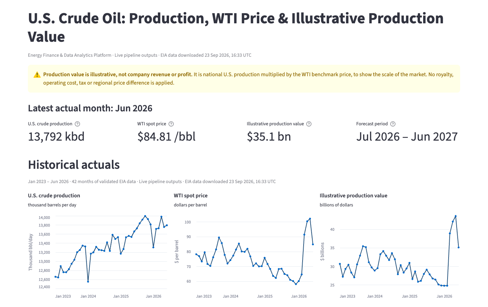
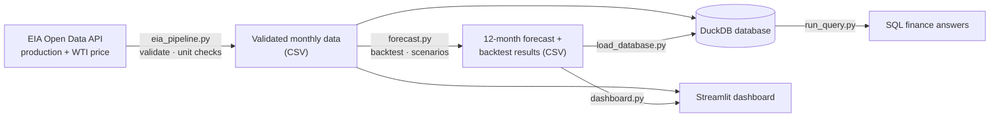
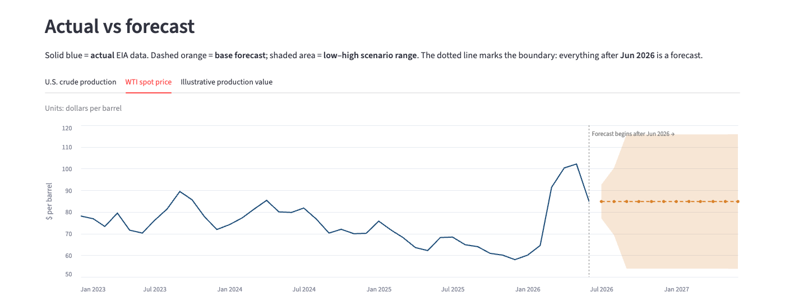
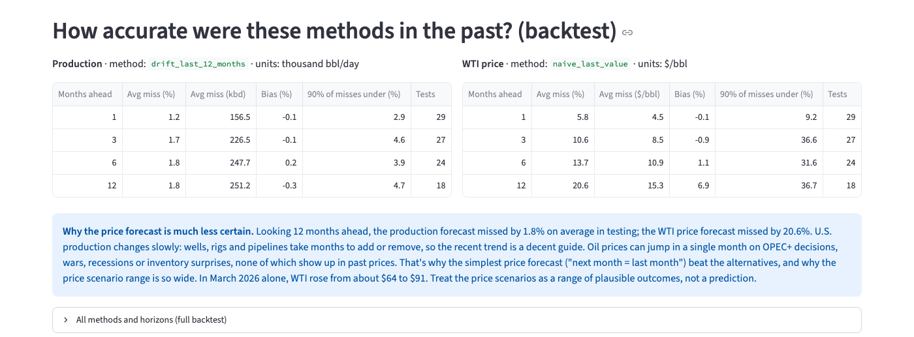

# Energy Finance & Data Analytics Platform

**An end-to-end pipeline that turns official U.S. government oil data into validated datasets, a backtested 12-month forecast, a SQL database and an executive dashboard.**

A portfolio project by Mansi, a finance graduate learning Python and data engineering.



## What it does

1. **Downloads** monthly U.S. crude oil production and WTI oil prices from the U.S. Energy Information Administration (EIA) API, and keeps the raw responses for audit.
2. **Validates** the data. It checks units, missing months, duplicates and negative values, and cross-checks two EIA production series against each other so unit mistakes are caught.
3. **Calculates** an illustrative production value each month: barrels × WTI price.
4. **Forecasts** production and price for 12 months with simple, explainable methods. It picks each method with a backtest that never uses future data, and gives low, base and high scenarios.
5. **Stores** everything in a DuckDB database, with SQL queries that answer finance questions such as price vs volume variance.
6. **Presents** it all in a local Streamlit dashboard.

## How the pipeline fits together



Each step stops with a clear message if its input is missing or fails validation, so a bad download never reaches the forecast, database or dashboard.

## Key results

These use EIA data through **June 2026**, downloaded on 23 Sep 2026.

| Measure | Result |
|---|---|
| **Latest month (Jun 2026)** | U.S. production 13,792 thousand barrels/day · WTI $84.81/bbl · illustrative production value $35.1 bn |
| **Production growth** | Production grew 2.6% in 2024 and 2.7% in 2025 |
| **2025 value change** | Production value fell **$45.7 bn**. Producing more barrels **added $10.0 bn**, the lower oil price **removed $54.3 bn**, and the combined effect was −$1.5 bn |
| **12-month outlook (Jul 2026 – Jun 2027)** | Base case **$429 bn**; low–high stress range **$277 bn – $594 bn**; last 12 actual months **$369 bn** |
| **Forecast accuracy (backtest)** | 12 months ahead, the production forecast missed by **1.8%** on average and the price forecast by **20.6%**. Price is by far the bigger source of uncertainty |



## Data sources

| Data | Source | Units |
|---|---|---|
| U.S. field production of crude oil (series `MCRFPUS1`, `MCRFPUS2`) | [EIA Open Data API v2](https://www.eia.gov/opendata/) | thousand barrels per month, and thousand barrels per day |
| WTI crude oil spot price, Cushing OK (series `RWTC`) | [EIA Open Data API v2](https://www.eia.gov/opendata/) | dollars per barrel |

All EIA data is public. Milestone 1 uses a small **fictional** well dataset for learning, which is clearly labelled and kept separate. No company data is used anywhere.

## Finance limitations

- **Production value is not company revenue or profit.** It is national production × a benchmark price, used to show the scale of the market. No royalty, operating cost, tax or regional price difference (the gap between a producer's selling price and WTI) is applied.
- **Oil prices are very hard to forecast.** The price scenarios reflect only 2023–2026 volatility. They don't cover events like the 2020 crash or the 2022 spike, and real prices can land outside the range.
- **The low and high scenarios are stress cases, not probabilities.** They pair low production with low price, and high with high.
- **The history is short: 42 months.** The forecast methods are deliberately simple baselines, and they don't use futures prices, rig counts or EIA's own outlook.
- **EIA revises recent months,** so results can change slightly after a new download.



## Skills demonstrated

- **Data engineering:** REST API ingestion, raw-data retention with source metadata, validation, rerunnable loads with one-transaction commits, and secret handling (the API key is read only from an environment variable).
- **Finance:** unit conversion (barrels per day to monthly volume to dollars), price/volume variance analysis, scenario analysis, and clear labelling of what a metric does and doesn't represent.
- **Forecasting:** baseline methods, a rolling-origin backtest with no look-ahead, and error metrics (MAPE, bias, P90).
- **Tools:** Python (standard library for the pipelines), SQL with DuckDB, Streamlit and Altair.

## Quick start (Mac)

Tested with Python 3.14 on macOS.

**See the dashboard right away, with no API key.** The repository includes a dated snapshot of the validated outputs in `data/snapshots/eia_2026-09-23/`: EIA data downloaded on 23 Sep 2026, actuals through June 2026. Until you run the pipelines yourself, the dashboard shows this snapshot, with a banner saying it is historical.

```bash
# 1. Set up (once)
cd energy-finance-platform
python3 -m venv .venv
.venv/bin/python -m pip install -r requirements.txt

# 2. Open the dashboard (shows the historical snapshot)
.venv/bin/streamlit run dashboard.py
```

**Load current data.** The live outputs, raw downloads and database aren't stored in the repository; you recreate them with a free EIA API key. Once the live outputs exist, the dashboard uses them instead of the snapshot.

```bash
# 3. Enter your EIA key privately for this Terminal window
#    (free at https://www.eia.gov/opendata/register.php; nothing is shown while you paste)
source .venv/bin/activate
read -rs EIA_API_KEY && export EIA_API_KEY

# 4. Download, validate, forecast and load the database
python eia_pipeline.py && python forecast.py && python load_database.py

# 5. Explore
python run_query.py all          # SQL finance questions
streamlit run dashboard.py       # dashboard at http://localhost:8501
```

## Project structure

| Path | Purpose |
|---|---|
| `eia_pipeline.py` | Downloads, validates and joins the EIA data |
| `forecast.py` | Backtest, method selection and 12-month scenarios |
| `load_database.py` | Loads the validated outputs into DuckDB, safe to rerun |
| `run_query.py`, `queries/*.sql` | Documented SQL finance questions |
| `dashboard.py` | Streamlit executive dashboard |
| `data/snapshots/eia_2026-09-23/` | Dated, **historical** snapshot of the validated outputs (3 CSVs + `snapshot_info.json` with EIA attribution, download time and checksums), so the dashboard runs without a key |
| `make_snapshot.py` | Re-validates the current outputs and writes a new dated snapshot |
| `pipeline.py`, `data/sample_monthly_oil.csv` | Milestone 1: fictional single-well example |
| `revenue.py` | First Python practice file |
| `docs/images/` | Dashboard screenshots |

---

# Detailed documentation

The rest of this README documents each milestone in detail. The project has these scripts:

| Script | Data | Output |
|---|---|---|
| `pipeline.py` (Milestone 1) | Fictional single-well sample data | `output/monthly_results.csv` |
| `eia_pipeline.py` (Milestone 2) | Official U.S. national data from the EIA | `output/eia_us_crude_production_value.csv` |
| `forecast.py` (Milestone 3) | Validated EIA output from Milestone 2 only | `output/forecast_backtest.csv`, `output/forecast_12_months.csv` |
| `dashboard.py` (Milestone 4) | Reads the Milestone 2 and 3 outputs; calculates nothing new | Local web dashboard at http://localhost:8501 |
| `load_database.py` (Milestone 5) | Copies the Milestone 2 and 3 outputs into DuckDB; calculates nothing new | `database/energy_finance.duckdb` |
| `run_query.py` (Milestone 5) | Runs the saved SQL in `queries/` against the database (read-only) | Results printed in Terminal |

The fictional pipeline and the EIA pipelines share no data or assumptions. The fictional royalty and operating cost apply only to the fictional well.

## Milestone 1: Monthly oil revenue pipeline

`pipeline.py` reads monthly oil production and prices, validates the data, calculates revenue, royalty, operating cost and profit for each month, and writes the results to a CSV file. It uses only Python's standard library, so there is nothing to install.

> **All Milestone 1 data is fictional sample data** made up for learning. It is not company data.

### Project layout

| Path | What it is |
|---|---|
| `data/sample_monthly_oil.csv` | Input: fictional monthly barrels produced and oil price |
| `pipeline.py` | The pipeline: read → validate → calculate → write |
| `output/monthly_results.csv` | Output, created when you run the pipeline (not saved in git) |
| `revenue.py` | Practice file |

### How to run it (Mac)

1. Open the **Terminal** app.
2. Go to the project folder:
   ```bash
   cd ~/energy-finance-platform
   ```
3. Turn on the virtual environment:
   ```bash
   source .venv/bin/activate
   ```
   Your prompt should now start with `(.venv)`.
4. Run the pipeline:
   ```bash
   python pipeline.py
   ```
5. Open the results:
   ```bash
   open output/monthly_results.csv
   ```
   The file opens in Numbers or Excel.

When you're done, type `deactivate` to turn the virtual environment off.

### Assumptions

These values are set at the top of `pipeline.py`. Change them to try different scenarios.

| Assumption | Value | Meaning |
|---|---|---|
| `ROYALTY_RATE` | 12.5% | Share of revenue paid to the mineral owner |
| `OPERATING_COST_PER_BARREL` | $22.00 | Cost to produce one barrel (lifting cost) |

### Formulas

- **Revenue** = barrels produced × price per barrel
- **Royalty** = revenue × royalty rate
- **Operating cost** = barrels produced × operating cost per barrel
- **Profit** = revenue − royalty − operating cost
- **Profit margin %** = profit ÷ revenue × 100

This is a simplified estimate. It leaves out taxes, transport costs, capital spending and depreciation.

### Data checks

The pipeline stops and lists every problem if any of these are true:
- a required column is missing
- a month isn't in `YYYY-MM` format
- a well name is blank
- the same well and month appear twice
- barrels or price are missing, not a number, or negative

## Milestone 2: EIA U.S. crude production value pipeline

`eia_pipeline.py` downloads official data from the U.S. Energy Information Administration (EIA). It saves the raw responses, validates them, joins production and price by month, and writes `output/eia_us_crude_production_value.csv`. It uses only Python's standard library.

### Data sources

Data comes from the EIA Open Data API v2. See https://www.eia.gov/opendata/.

| Data | API route | Series | Units | EIA page |
|---|---|---|---|---|
| U.S. field production of crude oil, monthly total | `/v2/petroleum/crd/crpdn/data/` | `MCRFPUS1` | `MBBL`: thousand barrels per month | https://www.eia.gov/dnav/pet/hist/LeafHandler.ashx?n=PET&s=MCRFPUS1&f=M |
| U.S. field production of crude oil, daily rate (used only as a cross-check) | `/v2/petroleum/crd/crpdn/data/` | `MCRFPUS2` | `MBBL/D`: thousand barrels per day | https://www.eia.gov/dnav/pet/hist/LeafHandler.ashx?n=PET&s=MCRFPUS2&f=M |
| WTI crude oil spot price, Cushing, OK (FOB), monthly average | `/v2/petroleum/pri/spt/data/` | `RWTC` | `$/BBL`: dollars per barrel | https://www.eia.gov/dnav/pet/hist/LeafHandler.ashx?n=PET&s=RWTC&f=M |

Each run requests data from `START_MONTH` (2023-01) onward and saves two files per dataset in `data/raw/eia/`:
- `<name>_<YYYY-MM-DD>.json`: the untouched API response
- `<name>_<YYYY-MM-DD>.source.json`: the request URL (without the API key) and the exact download time in UTC

The first download was on **2026-09-23**. It returned production through 2026-06 and prices through 2026-08. EIA publishes production about two months after prices, so the latest price months are left out until production catches up. EIA also revises recent months, so later downloads can differ slightly.

### Calculation and unit conversion

- **Production (barrels)** = `MCRFPUS1` (thousand barrels) × 1,000
- **Illustrative production value ($)** = production (barrels) × WTI spot price ($/barrel)

The units multiply out as barrels × dollars per barrel = dollars.

Unit cross-check: for every month, the daily rate (`MCRFPUS2`) × days in the month must equal the monthly total (`MCRFPUS1`) within 0.5%. They differ slightly only because EIA rounds each series. If someone used the daily rate as if it were a monthly total, volume would be about 30 times too small, and the check would stop the pipeline.

Example: June 2026 is 413,758 thousand bbl × 1,000 × $84.81/bbl = $35,090,815,980, about $35.09 billion. As a cross-check, 13,792 thousand bbl/day × 30 days = 413,760 thousand bbl.

> **What this number is not.** Production value is a rough market value of all U.S. crude produced in a month, priced at the WTI benchmark. It is **not** the revenue or profit of any company. Producers sell at prices above or below WTI depending on location and quality. No royalty, operating cost or tax is applied. The fictional Milestone 1 assumptions (12.5% royalty, $22/bbl) are not used here.

### Data checks

The pipeline stops and lists every problem if:
- the API returns an error or no data
- any value has units other than those expected (`MBBL`, `MBBL/D`, `$/BBL`)
- a month is badly formatted or appears twice
- a value is missing, not a number, zero or negative
- the daily × days cross-check fails
- there is a gap in the joined months
- fewer than 24 months have both production and price

### Get a free EIA API key

1. Register at https://www.eia.gov/opendata/register.php. You only need to give your email address.
2. EIA emails you the key.

The key is read from the `EIA_API_KEY` environment variable. **Never** put it in a project file. The pipeline doesn't save it anywhere: raw files record the URL with the key removed.

### How to run it (Mac)

1. Open **Terminal** and go to the project:
   ```bash
   cd ~/energy-finance-platform
   source .venv/bin/activate
   ```
2. Set your key for this Terminal window only. Type it at the prompt so it isn't saved in your shell history:
   ```bash
   read -rs EIA_API_KEY && export EIA_API_KEY
   ```
   Paste the key and press Return. Nothing is shown while you type.
3. Run the pipeline:
   ```bash
   python eia_pipeline.py
   ```
4. Open the results:
   ```bash
   open output/eia_us_crude_production_value.csv
   ```

To test the pipeline before your key arrives, you can use EIA's shared demo key. It has a low rate limit, so it can fail when many people use it:
```bash
export EIA_API_KEY=DEMO_KEY
```

**If you see `CERTIFICATE_VERIFY_FAILED`:** Python from python.org on a Mac doesn't install its own list of trusted certificates. The pipeline already falls back to macOS's certificate file, `/etc/ssl/cert.pem`. To fix it for all Python programs, double-click `/Applications/Python 3.14/Install Certificates.command` once.

## Milestone 3: 12-month forecast of U.S. production, WTI price and production value

`forecast.py` forecasts U.S. crude production and the WTI spot price for the next 12 months, then calculates an illustrative production value from those forecasts. It reads only `output/eia_us_crude_production_value.csv`, the validated Milestone 2 output. It uses only Python's standard library.

### How to run it (Mac)

```bash
cd ~/energy-finance-platform
source .venv/bin/activate
python forecast.py
open output/forecast_12_months.csv
```

`forecast.py` does not call the EIA API, so it needs no API key. To forecast from newer data, first rerun `python eia_pipeline.py` (see Milestone 2), then `python forecast.py`.

### What it does

1. **Re-checks the input.** It confirms:
   - months are consecutive with no gaps
   - values are positive
   - daily rate × days = monthly total
   - production value = barrels × price
   - there are at least 24 months
2. **Backtests three baseline methods** on each series.
3. **Selects** the method with the lowest average error across horizons 1–12 for each series separately.
4. **Forecasts 12 months** after the last actual month, with low, base and high scenarios.
5. **Writes two files:**
   - `output/forecast_backtest.csv`: errors for every series, method and horizon
   - `output/forecast_12_months.csv`: actual history followed by 12 forecast rows

### Baseline methods

| Method | Rule | Finance analogy |
|---|---|---|
| `naive_last_value` | Every future month = the last actual month | "Next quarter looks like this quarter" |
| `average_last_3_months` | Every future month = average of the last 3 months | A trailing 3-month average |
| `drift_last_12_months` | Continue the average monthly change of the last 12 months in a straight line | Extrapolating the trailing 12-month trend |

These are deliberately simple. A more complex model has to beat them before it's worth adding.

**Production is forecast as a daily rate** (thousand barrels per day), then converted into a monthly volume. This keeps a 28-day February from looking like a production drop.

### Backtest (no look-ahead)

The backtest uses a rolling origin. For each month from the 13th month onward, the method sees only data up to and including that month. It forecasts the next 1–12 months, and those forecasts are compared with what actually happened. Data after the origin is never passed to the method. A test that changed future values confirmed that earlier forecasts stayed the same.

Errors are reported separately for production and price at each horizon:
- **MAPE**: mean absolute % error
- **MAE**: mean absolute error, in the series' units
- **bias**: average signed % error; negative means the forecasts were too low
- **P90 absolute % error**: 90% of backtest forecasts missed by less than this

Results from the 2026-09-23 run (42 months, 2023-01 to 2026-06):

| Series | Selected method | MAPE 1 month ahead | 3 months | 6 months | 12 months |
|---|---|---|---|---|---|
| Production (thousand bbl/day) | `drift_last_12_months` | 1.2% | 1.7% | 1.8% | 1.8% |
| WTI price ($/bbl) | `naive_last_value` | 5.8% | 10.6% | 13.7% | 20.6% |

Price errors are roughly 5 to 10 times larger than production errors.

### Scenarios and assumptions

| Scenario | Production | WTI price |
|---|---|---|
| **Base** | Selected method's forecast | Selected method's forecast |
| **Low** | Base × (1 − P90 backtest % error at that horizon) | Same rule |
| **High** | Base × (1 + P90 backtest % error at that horizon) | Same rule |

- A band never narrows at a longer horizon. If the backtest gives a smaller P90 at month 5 than at month 3, the month-3 width is kept, because uncertainty doesn't shrink with time.
- **Production value** = forecast production (thousand bbl/day) × days in month × 1,000 × forecast WTI ($/bbl), which gives dollars. It's shown in $ billions.
- The low value is low production × low price, and the high value is high production × high price. That pairs two extremes, so it's a wide stress range, not a probability interval.

### Reading `forecast_12_months.csv`

- `record_type` is `actual` for EIA data and `forecast` for projections.
- Actual values are only in `actual_*` columns, and forecasts are only in `forecast_*` columns. No row has both.
- `forecast_made_from_data_through` shows the last actual month the forecast was built from.

### Limitations

- **WTI prices are especially uncertain.** Oil prices react to OPEC+ decisions, wars, recessions, pandemics and inventory surprises, and none of these can be predicted from past prices. The naive method is best here because prices behave close to a random walk.
- The price bands come from only 2023–2026. They include the March 2026 jump from $64 to $91, but they don't cover events like the 2020 crash (WTI briefly went negative) or the 2022 spike. Real prices can land outside the low–high range.
- The history is short: 42 months. The 12-month horizon has only 18 backtest forecasts.
- The same backtest is used to pick the method and to measure its error, so the reported errors are slightly optimistic.
- Production has winter storm dips (for example January 2024 and January 2026) that these methods don't model.
- The forecasts don't use futures prices, rig counts, EIA's own forecast (STEO), or any outside information.
- Recent EIA months are often revised, so rerunning after a new download can change results.

> **Production value is not company revenue or profit.** It is national volume × a benchmark price, used to show the scale of the market. No royalty, cost, tax or price difference from WTI is applied. The fictional Milestone 1 assumptions are not used.

## Milestone 4: Executive dashboard (local Streamlit app)

`dashboard.py` is a local web dashboard that shows:
- the latest actual month's production, WTI price and illustrative production value, with units
- historical charts of all three from 2023 onward
- actual vs forecast charts, with a dotted boundary after the last actual month (June 2026) and a shaded low–high range
- the 12-month low, base and high scenario table, with a **Download scenario table (CSV)** button
- a compact backtest section with production and price errors shown separately, and a plain-English explanation of why price is much less certain
- the EIA sources, download times, forecast assumptions and limitations
- a visible statement, at the top and the bottom, that production value is not company revenue or profit

The dashboard only **reads** these files. Every number comes from the pipelines.
- `output/eia_us_crude_production_value.csv` (from `eia_pipeline.py`)
- `output/forecast_12_months.csv` and `output/forecast_backtest.csv` (from `forecast.py`)
- `data/raw/eia/*.source.json` (download details)

**Where the data comes from:**
- **Live:** when all three `output/` files exist, the dashboard shows them. Its caption says "Live pipeline outputs" and gives the EIA download time.
- **Historical snapshot:** if any live file is missing, the dashboard falls back to the newest folder in `data/snapshots/`. A 🕰️ banner at the top says it's a historical snapshot, gives the EIA download date and the months it covers, and lists the missing live files. The sources section shows EIA's attribution, and the downloaded scenario table's file name starts with `snapshot_`.
- **Neither:** the dashboard lists the missing files and shows the commands to run.

If the EIA data is newer than the forecast, the dashboard asks you to rerun `python forecast.py`.

### Launch the dashboard (Mac)

```bash
cd ~/energy-finance-platform && .venv/bin/streamlit run dashboard.py
```

Your browser opens at http://localhost:8501. Press `Ctrl+C` in Terminal to stop it.

### First-time setup

Only the dashboard and the database need extra packages. If you recreate `.venv` or set up on another Mac, install them once:

```bash
cd ~/energy-finance-platform && .venv/bin/python -m pip install -r requirements.txt
```

`requirements.txt` pins `streamlit`, `altair` (charts), `pandas` (tables) and `duckdb` (Milestone 5). The three pipeline scripts still use only the standard library.

`.streamlit/config.toml` keeps the app private: it listens only on `localhost`, and Streamlit's usage statistics are turned off.

To refresh the data behind the dashboard, see [Refreshing everything with new data](#refreshing-everything-with-new-data) at the end of this README.

## Milestone 5: Local DuckDB database and SQL queries

`load_database.py` copies the validated outputs of Milestones 2 and 3 into a local [DuckDB](https://duckdb.org/) database, `database/energy_finance.duckdb`, so you can analyze them with SQL. It **doesn't recalculate anything**. The CSV files in `output/` stay the source of truth, and the pipelines are unchanged.

### Tables

| Table | One row per | Key | Loaded from |
|---|---|---|---|
| `eia_actuals_monthly` | month of validated EIA actuals | `month` | `output/eia_us_crude_production_value.csv` |
| `forecast_runs` | forecast run: its methods, horizon and first/last forecast month | `forecast_origin` | `forecast_12_months.csv`, `forecast_backtest.csv` |
| `forecast_scenarios_monthly` | forecast month × scenario (`low` / `base` / `high`) | `forecast_origin, month, scenario` | `output/forecast_12_months.csv` (forecast rows only) |
| `backtest_results` | series × method × horizon, per forecast run | `forecast_origin, series, method, horizon_months` | `output/forecast_backtest.csv` |
| `forecast_base_monthly` (view) | base-scenario forecast month, with the run's methods | n/a | built from the two forecast tables |

- **Dates:** `month` is stored as the first day of the month, for example `2026-06-01`.
- **`forecast_origin`:** the last actual month a forecast was built from (`2026-06-01` for the current forecast).
- **Units:** units are in the column names. Money columns and EIA values use exact decimal types, so the database matches the CSVs to the cent.
- **Production value is illustrative, not company revenue or profit.** Fictional Milestone 1 data is not loaded.

### Safe to rerun

- **Actuals** are keyed by month. Reloading replaces a month, for example after an EIA revision, and never duplicates it.
- **Forecasts** are keyed by `forecast_origin`. Reloading the same forecast replaces its rows. A forecast built from newer data is **added**, and older forecast runs are kept, so you can later compare past forecasts with what actually happened (query 05).
- **One transaction.** Every load is one transaction. Before saving, the loader checks every loaded row against the CSVs, reading them with Python's own CSV reader rather than DuckDB's, and checks that no keys are duplicated. If anything differs, nothing is saved.
- **Stale forecasts are refused.** If the EIA file is newer than the forecast, the loader stops and asks you to run `python forecast.py`.

### Build or refresh the database

```bash
cd ~/energy-finance-platform && .venv/bin/python load_database.py
```

It prints the row counts next to the CSV counts, for example 42 actual months, 36 scenario rows (12 months × 3) and 72 backtest rows.

### Run the saved SQL queries

```bash
cd ~/energy-finance-platform && source .venv/bin/activate
python run_query.py          # list the queries and the question each answers
python run_query.py 02       # run one query by number
python run_query.py all      # run all of them
```

The database is opened read-only for queries. Each `.sql` file in `queries/` starts with comments explaining the question and the method.

| Query | Finance question |
|---|---|
| `01_yoy_production_change` | How much did production change versus the same month last year? Uses barrels per day so month lengths don't distort it. |
| `02_price_volume_effects` | Why did annual production value change? Splits the change into a **volume effect** (more barrels at last year's price), a **price effect** (price change on last year's barrels) and the **interaction**. The three add up exactly to the total change. |
| `03_scenario_range_12m` | Next 12 months of production value for the low, base and high scenarios, next to the last 12 actual months |
| `04_backtest_accuracy` | Production vs price forecast error by horizon, and how many times larger the price error is |
| `05_forecast_vs_actual` | How did earlier forecasts do once actuals arrived? Returns no rows until a later EIA download covers forecast months. |

For example, query 02 shows that in 2025 production value fell by $45.7 bn. Producing more barrels added $10.0 bn, the lower WTI price removed $54.3 bn, and the interaction was −$1.5 bn.

To write your own SQL, open the database from Python:
```python
import duckdb
con = duckdb.connect("database/energy_finance.duckdb", read_only=True)
con.sql("SELECT * FROM eia_actuals_monthly ORDER BY month DESC LIMIT 5").show()
```

### Why the dashboard still reads the CSV files

Pointing the dashboard at DuckDB was considered and rejected:
- **It wouldn't make anything clearer.** The dashboard shows the same validated numbers either way, and the CSVs are the source of truth the database is loaded from.
- **It would add a way to break the refresh.** DuckDB lets only one program write to the file, and while any other program has it open, a write fails. In a test, while another process held the database open, `load_database.py` stopped with `Could not set lock on file`. A running dashboard holding the database would have that effect.
- **It would add a step.** The dashboard would also need `load_database.py` to have run.

The dashboard therefore keeps reading `output/*.csv`, or the committed snapshot when those files are missing. The database is for SQL analysis. If you query the database from another tool, close it before running `load_database.py`.

### Keeping things out of Git

`.gitignore` excludes:
- `database/`, `*.duckdb` and `*.duckdb.wal` (the database can be rebuilt with one command)
- `output/` and `data/raw/` (live outputs and raw API responses)
- `.env`, `.env.*` and `.streamlit/secrets.toml`
- `.claude/`
- `.venv/`

`data/snapshots/` **is** committed. It holds only the three validated CSVs and a metadata file for each dated snapshot, with no raw responses and no keys.

The EIA API key is only ever read from the `EIA_API_KEY` environment variable and is never written to a file, the database or a snapshot.

## Refreshing everything with new data

Run this once a month, after EIA publishes new data:

```bash
cd ~/energy-finance-platform && source .venv/bin/activate
read -rs EIA_API_KEY && export EIA_API_KEY      # paste your EIA key; it isn't shown or saved
python eia_pipeline.py && python forecast.py && python load_database.py
python run_query.py all                          # optional: SQL answers
streamlit run dashboard.py                       # dashboard at http://localhost:8501
```

Each step stops with a clear message if its input is missing or fails validation, so a bad download never reaches the forecast, database or dashboard.

**Optional: update the committed snapshot.** After a successful refresh, `python make_snapshot.py` re-validates the outputs and writes `data/snapshots/eia_<download date>/`. The dashboard's fallback uses the newest snapshot folder. Delete older snapshot folders if you only want to keep one, and update the snapshot date in the Quick start.
